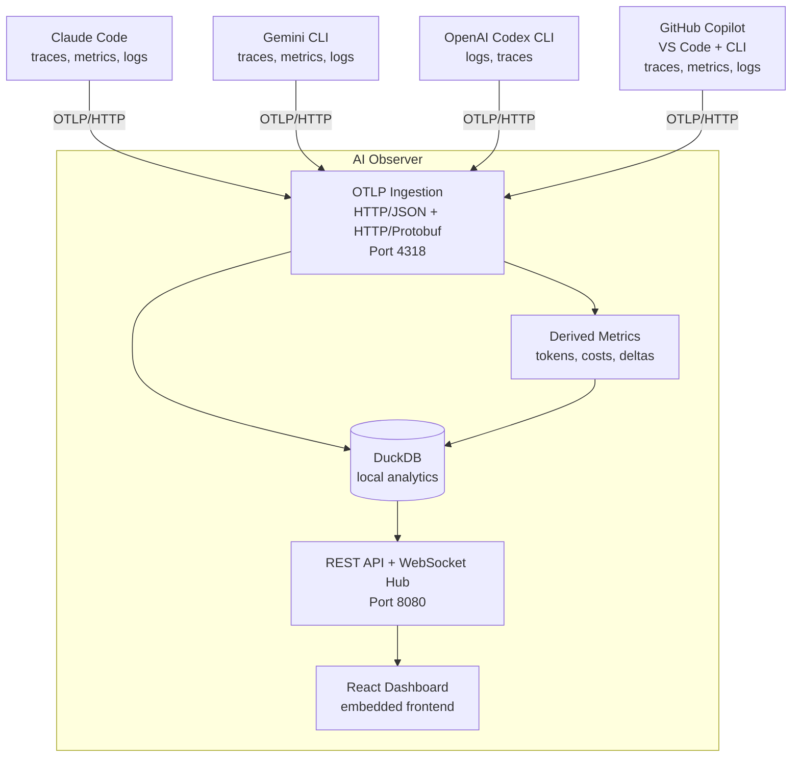
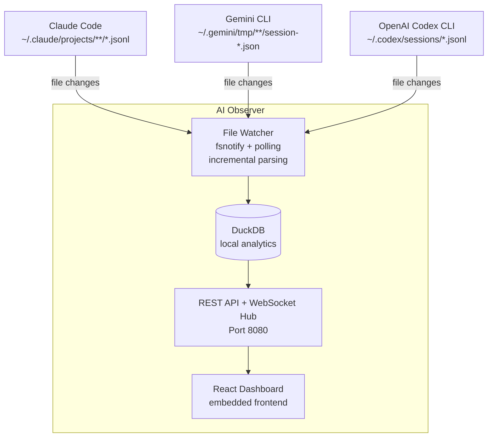
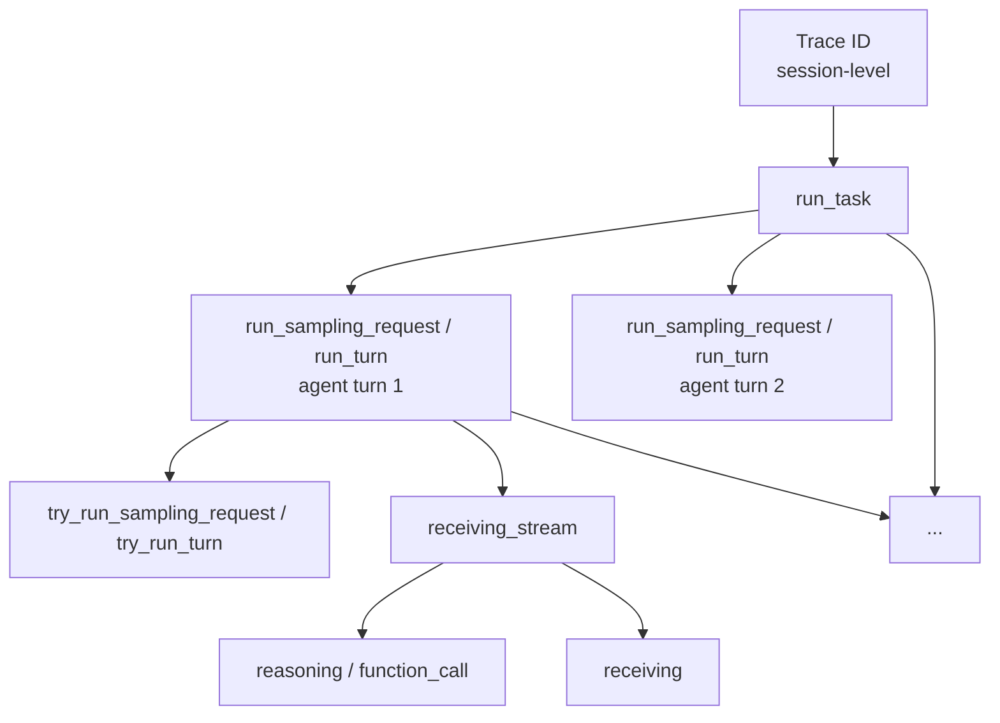

# AI Observer

> Unified local observability for AI coding assistants

**AI Observer** is a self-hosted, single-binary, OpenTelemetry-compatible observability backend designed specifically for monitoring local AI coding tools like Claude Code, Gemini CLI, OpenAI Codex CLI, and GitHub Copilot.

Track token usage, costs, API latency, error rates, and session activity across all your AI coding assistants in one unified dashboard—with real-time updates and zero external dependencies.

## Why AI Observer?

AI coding assistants are becoming essential development tools, but understanding their behavior and costs remains a challenge:

- **Visibility**: See exactly how your AI tools are performing across sessions
- **Cost tracking**: Monitor token usage and API calls to understand spending
- **Debugging**: Trace errors and slow responses back to specific interactions
- **Privacy**: Keep your telemetry data local—no third-party services required

## Features

- **Multi-tool support** — Works with Claude Code, Gemini CLI, OpenAI Codex CLI, and GitHub Copilot
- **Real-time dashboard** — Live updates via WebSocket as telemetry arrives
- **Persistent dashboards** — Drag-and-drop dashboard builder with saved widgets and multiple widget types
- **File watcher mode** — Watch Claude, Codex, and Gemini session files in real-time, no OTLP configuration needed
- **Historical import** — Import past Claude, Codex, and Gemini sessions from local JSONL/JSON files with cost calculation
- **Cost tracking** — Embedded pricing data across Claude, Codex/OpenAI, Gemini, and GitHub Copilot model aliases
- **Fast analytics** — DuckDB-powered storage for instant queries on large datasets
- **Single binary** — One ~54MB executable with embedded frontend—no external dependencies
- **Multi-arch Docker** — Ready-to-run ~97MB images for `linux/amd64` and `linux/arm64`
- **OTLP-native** — Standard OpenTelemetry Protocol ingestion (HTTP/JSON and HTTP/Protobuf)

## Documentation

- [Import Command](docs/import.md) — Import historical session data from local AI tool files
- [Export Command](docs/export.md) — Export telemetry data to Parquet files for archiving and sharing
- [Watch Command](#watch-command) — Watch local session files and import incrementally in real-time
- [Pricing System](docs/pricing.md) — Cost calculation for Claude, Codex/OpenAI, Gemini, and GitHub Copilot models

## Screenshots

### Dashboard


### Metrics View


### Logs View


### Traces View


## Quick Start

### Using Docker (Recommended)

```bash
docker run -d \
  -p 8080:8080 \
  -p 4318:4318 \
  -v ai-observer-data:/app/data \
  --name ai-observer \
  tobilg/ai-observer:latest
```

Dashboard: http://localhost:8080

**Using a local directory for data persistence:**

```bash
# Create a local data directory
mkdir -p ./ai-observer-data

# Run with local volume mount
docker run -d \
  -p 8080:8080 \
  -p 4318:4318 \
  -v $(pwd)/ai-observer-data:/app/data \
  -e AI_OBSERVER_DATABASE_PATH=/app/data/ai-observer.duckdb \
  --name ai-observer \
  tobilg/ai-observer:latest
```

This stores the DuckDB database in your local `./ai-observer-data` directory, making it easy to backup or inspect.

### Using Homebrew (macOS Apple Silicon)

```bash
brew tap tobilg/ai-observer
brew install ai-observer
ai-observer
```

### Using Binary

Download the latest release for your platform from [Releases](https://github.com/tobilg/ai-observer/releases), then:

```bash
./ai-observer
```

### Building from Source

```bash
git clone https://github.com/tobilg/ai-observer.git
cd ai-observer
make setup   # Install dependencies
make all     # Build single binary with embedded frontend
./bin/ai-observer
```

## Configuration

### Environment Variables

| Variable | Default | Description |
|----------|---------|-------------|
| `AI_OBSERVER_API_PORT` | `8080` | HTTP server port (dashboard + API) |
| `AI_OBSERVER_OTLP_PORT` | `4318` | OTLP ingestion port |
| `AI_OBSERVER_DATABASE_PATH` | `./data/ai-observer.duckdb` (binary) or `/app/data/ai-observer.duckdb` (Docker) | DuckDB database file path |
| `AI_OBSERVER_FRONTEND_URL` | `http://localhost:5173` | Allowed CORS origin (dev mode) |
| `AI_OBSERVER_LOG_LEVEL` | `INFO` | Log level: `DEBUG`, `INFO`, `WARN`, `ERROR` |

CORS and WebSocket origins allow `AI_OBSERVER_FRONTEND_URL` plus `http://localhost:5173` and `http://localhost:8080`; set `AI_OBSERVER_FRONTEND_URL` when serving a custom UI origin.

### CLI Options

```bash
ai-observer [command] [options]
```

**Commands:**
| Command | Description |
|---------|-------------|
| `import` | Import local sessions from AI tool files |
| `export` | Export telemetry data to Parquet files |
| `delete` | Delete telemetry data from database |
| `setup` | Show setup instructions for AI tools |
| `watch` | Watch local session files and import incrementally |
| `serve` | Start the OTLP server (default if no command) |

**Global Options:**
| Option | Description |
|--------|-------------|
| `-h`, `--help` | Show help message and exit |
| `-v`, `--version` | Show version information and exit |

**Examples:**

```bash
# Start the server (default, no command needed)
ai-observer

# Show version
ai-observer --version

# Show setup instructions for Claude Code
ai-observer setup claude-code

# Show setup instructions for GitHub Copilot
ai-observer setup github-copilot

# Import data from all file-backed AI tools
ai-observer import all

# Export data to Parquet files
ai-observer export all --output ./export

# Delete data in a date range
ai-observer delete all --from 2025-01-01 --to 2025-01-31

# Watch local session files for changes
ai-observer watch all
```

### Import Command

Import historical session data from local AI coding tool files into AI Observer.

```bash
ai-observer import [claude-code|codex|gemini|all] [options]
```

| Option | Description |
|--------|-------------|
| `--from DATE` | Only import sessions from DATE (YYYY-MM-DD) |
| `--to DATE` | Only import sessions up to DATE (YYYY-MM-DD) |
| `--force` | Re-import already imported files |
| `--dry-run` | Show what would be imported without making changes |
| `--skip-confirm` | Skip confirmation prompt |
| `--purge` | Delete existing data in time range before importing |
| `--pricing-mode MODE` | Cost calculation mode for Claude: `auto` (default), `calculate`, `display` |
| `--verbose` | Show detailed progress |

**File locations:**

| Tool | Default Location |
|------|------------------|
| Claude Code | `~/.claude/projects/**/*.jsonl` |
| Codex CLI | `~/.codex/sessions/*.jsonl` |
| Gemini CLI | `~/.gemini/tmp/**/session-*.json` |

Override with environment variables: `AI_OBSERVER_CLAUDE_PATH`, `AI_OBSERVER_CODEX_PATH`, `AI_OBSERVER_GEMINI_PATH`

**Examples:**

```bash
# Import from all file-backed tools
ai-observer import all

# Import Claude data from specific date range
ai-observer import claude-code --from 2025-01-01 --to 2025-12-31

# Dry run to see what would be imported
ai-observer import all --dry-run

# Force re-import and recalculate costs
ai-observer import claude-code --force --pricing-mode calculate
```

See [docs/import.md](docs/import.md) for detailed documentation and [docs/pricing.md](docs/pricing.md) for pricing calculation details.

### Watch Command

Watch local session files in real-time and import new data incrementally as it's written. This is an alternative to configuring OTLP exporters for Claude Code, Codex CLI, and Gemini CLI — just start the watcher and it picks up data from those tools' native log files.

```bash
ai-observer watch [claude-code|codex|gemini|all] [options]
```

| Option | Description |
|--------|-------------|
| `--backfill` | On first start, load all existing session data before watching |

**How it works:**

- **First start (default):** Records the current position in each file without importing historical data. Only data written after startup is imported.
- **First start with `--backfill`:** Loads all existing session data, then watches for new changes.
- **Restart:** Resumes from where it left off, importing any data written while the watcher was stopped.

At startup, the watcher detects which tools are installed and reports their status:

```
File watcher starting...
  [claude-code] Watching ~/.claude/projects/ (2 directories)
  [codex]       Watching ~/.codex/sessions/ (1 directory)
  [gemini]      ~/.gemini/tmp/ not found — will poll for directory creation
```

Directories that don't exist yet are polled every 30 seconds and automatically added when they appear.

**File locations** are the same as the import command — override with `AI_OBSERVER_CLAUDE_PATH`, `AI_OBSERVER_CODEX_PATH`, `AI_OBSERVER_GEMINI_PATH`.

> **Note:** Watch mode and OTLP ingestion (`serve`) are mutually exclusive. Running both simultaneously would produce duplicate data. Use `watch` for file-based ingestion or `serve` for OTLP — not both.
> GitHub Copilot is OTLP-only in AI Observer; use `serve` and the Copilot OTLP settings below.

**Examples:**

```bash
# Watch all file-backed tools for new data
ai-observer watch all

# Watch only Claude Code sessions
ai-observer watch claude-code

# First run: load all historical data, then watch
ai-observer watch all --backfill

# Watch Gemini CLI only
ai-observer watch gemini
```

### Export Command

Export telemetry data to portable Parquet files with an optional DuckDB views database.

```bash
ai-observer export [claude-code|codex|gemini|copilot-chat|github-copilot|all] --output <directory> [options]
```

| Option | Description |
|--------|-------------|
| `--output DIR` | Output directory (required) |
| `--from DATE` | Start date filter (YYYY-MM-DD) |
| `--to DATE` | End date filter (YYYY-MM-DD) |
| `--from-files` | Read from raw JSON/JSONL files instead of database |
| `--zip` | Create single ZIP archive of exported files |
| `--dry-run` | Preview what would be exported |
| `--verbose` | Show detailed progress |
| `--yes` | Skip confirmation prompt |

**Output files:**
- `traces.parquet` — All trace/span data
- `logs.parquet` — All log records
- `metrics.parquet` — All metric data points
- `ai-observer-export-{SOURCE}-{RANGE}.duckdb` — Views database with relative paths

**Examples:**

```bash
# Export all data from database
ai-observer export all --output ./export

# Export Claude data with date filter
ai-observer export claude-code --output ./export --from 2025-01-01 --to 2025-01-15

# Export GitHub Copilot VS Code Extension telemetry
ai-observer export copilot-chat --output ./export

# Export to ZIP archive
ai-observer export all --output ./export --zip

# Export directly from raw files (without prior import)
ai-observer export claude-code --output ./export --from-files

# Dry run to preview export
ai-observer export all --output ./export --dry-run
```

> `--from-files` is only available for local file sources (`claude-code`, `codex`, `gemini`, `all`). GitHub Copilot is OTLP-only and exports from the DuckDB database.

See [docs/export.md](docs/export.md) for detailed documentation.

### Delete Command

Delete telemetry data from the database by time range.

```bash
ai-observer delete [logs|metrics|traces|all] --from DATE --to DATE [options]
```

| Option | Description |
|--------|-------------|
| `--from DATE` | Start date (YYYY-MM-DD, required) |
| `--to DATE` | End date (YYYY-MM-DD, required) |
| `--service NAME` | Only delete data for specific service |
| `--yes` | Skip confirmation prompt |

**Examples:**

```bash
# Delete all data in a date range
ai-observer delete all --from 2025-01-01 --to 2025-01-31

# Delete only logs in a date range
ai-observer delete logs --from 2025-01-01 --to 2025-01-31

# Delete only Claude Code data
ai-observer delete all --from 2025-01-01 --to 2025-01-31 --service claude-code

# Skip confirmation prompt
ai-observer delete all --from 2025-01-01 --to 2025-01-31 --yes
```

### AI Tool Setup

<details>
<summary><strong>Claude Code</strong></summary>

Configure the following environment variables:

```bash
# Enable telemetry (required)
export CLAUDE_CODE_ENABLE_TELEMETRY=1

# Configure exporters
export OTEL_METRICS_EXPORTER=otlp
export OTEL_LOGS_EXPORTER=otlp

# Set OTLP endpoint (HTTP)
export OTEL_EXPORTER_OTLP_PROTOCOL=http/protobuf
export OTEL_EXPORTER_OTLP_ENDPOINT=http://localhost:4318

# Set shorter intervals
export OTEL_METRIC_EXPORT_INTERVAL=10000  # 10 seconds (default: 60000ms)
export OTEL_LOGS_EXPORT_INTERVAL=5000     # 5 seconds (default: 5000ms)
```

Add these to your `~/.bashrc`, `~/.zshrc`, or shell profile to persist across sessions.

Claude Code will then automatically send metrics and events to AI Observer.

</details>

<details>
<summary><strong>Gemini CLI</strong></summary>
We assume you have at least Gemini CLI in version `v0.34.0` because all version before had a bug regarding OTLP publishing.

Add to `~/.gemini/settings.json`:

```json
{
  "telemetry": {
    "enabled": true,
    "target": "local",
    "useCollector": true,
    "otlpEndpoint": "http://localhost:4318",
    "otlpProtocol": "http",
    "logPrompts": true
  }
}
```

**Required environment variables** (workaround for Gemini CLI timing issues):

```bash
export OTEL_METRIC_EXPORT_TIMEOUT=10000
export OTEL_LOGS_EXPORT_TIMEOUT=5000
```

</details>

<details>
<summary><strong>OpenAI Codex CLI</strong></summary>

Add to `~/.codex/config.toml`:

```toml
[otel]
log_user_prompt = true  # set to false to redact prompts
exporter = { otlp-http = { endpoint = "http://localhost:4318/v1/logs", protocol = "binary" } }
trace_exporter = { otlp-http = { endpoint = "http://localhost:4318/v1/traces", protocol = "binary" } }
```

> **Note**: Codex CLI exports logs and traces (no metrics). The `trace_exporter` option is undocumented but available—if omitted, traces are sent to the same endpoint as logs.

</details>

<details>
<summary><strong>GitHub Copilot</strong></summary>

GitHub Copilot can export OTLP telemetry from the VS Code extension and CLI. AI Observer stores the raw telemetry and derives token and cost metrics from chat spans.

**VS Code settings:**

```json
{
  "github.copilot.chat.otel.enabled": true,
  "github.copilot.chat.otel.exporterType": "otlp-http",
  "github.copilot.chat.otel.otlpEndpoint": "http://localhost:4318",
  "github.copilot.chat.otel.captureContent": true
}
```

**Environment variables:**

```bash
export COPILOT_OTEL_ENABLED=true
export OTEL_EXPORTER_OTLP_ENDPOINT=http://localhost:4318
export OTEL_EXPORTER_OTLP_PROTOCOL=http/protobuf
export COPILOT_OTEL_CAPTURE_CONTENT=true
```

Service names:

| Service | Source |
|---------|--------|
| `copilot-chat` | GitHub Copilot VS Code Extension |
| `github-copilot` | GitHub Copilot CLI |

> Content capture can include prompts, code, tool arguments, and tool results. Only enable it in trusted local environments.

</details>

## Architecture

**OTLP mode** (`ai-observer` or `ai-observer serve`):



**File watcher mode** (`ai-observer watch all`):



GitHub Copilot is not shown in watcher mode because AI Observer currently receives Copilot telemetry through OTLP only.

**Tech Stack**:
- **Backend**: Go 1.26+, chi router, DuckDB 1.5.3, gorilla/websocket
- **Frontend**: React 19, TypeScript, Vite, Tailwind CSS v4, Zustand, Recharts

## API Reference

AI Observer exposes two HTTP servers:

### OTLP Ingestion (Port 4318)

Standard OpenTelemetry Protocol endpoints for receiving telemetry data.
- Transport is HTTP/1.1 + h2c (no gRPC listener exposed); `Content-Encoding: gzip` is supported for compressed payloads.

| Method | Endpoint | Description |
|--------|----------|-------------|
| `POST` | `/v1/traces` | Ingest trace spans (protobuf or JSON) |
| `POST` | `/v1/metrics` | Ingest metrics (protobuf or JSON) |
| `POST` | `/v1/logs` | Ingest logs (protobuf or JSON) |
| `GET` | `/health` | Health check |

### Query API (Port 8080)

REST API for querying stored telemetry data. Unless otherwise specified, `from`/`to` default to the last 24 hours.

<details>
<summary><strong>Traces</strong></summary>

| Method | Endpoint | Description |
|--------|----------|-------------|
| `GET` | `/api/traces` | List traces with filtering and pagination |
| `GET` | `/api/traces/recent` | Get most recent traces |
| `GET` | `/api/traces/{id}?kind={kind}` | Get spans for a trace row |
| `GET` | `/api/traces/{id}/spans?kind={kind}` | Get all spans for a trace row |

**Query parameters for `/api/traces`:**
- `service` — Filter by service name
- `search` — Full-text search
- `from`, `to` — Time range (ISO 8601)
- `limit`, `offset` — Pagination

Trace list rows include `id`, `kind`, `traceId`, and `rootSpanId`. Use the `id` and `kind` values from a trace row when requesting details. Most rows, including GitHub Copilot and raw Codex session traces, use `kind=otel_trace` with `id` set to the OTLP trace ID. Codex operation rows, where present, use `kind=codex_operation` with `id`/`rootSpanId` set to the operation root span ID.

</details>

<details>
<summary><strong>Metrics</strong></summary>

| Method | Endpoint | Description |
|--------|----------|-------------|
| `GET` | `/api/metrics` | List metrics with filtering |
| `GET` | `/api/metrics/names` | List all metric names |
| `GET` | `/api/metrics/series` | Get time series data for a metric |
| `POST` | `/api/metrics/batch-series` | Get multiple time series in one request |

**Query parameters for `/api/metrics/series`:**
- `name` — Metric name (required)
- `service` — Filter by service
- `from`, `to` — Time range (ISO 8601)
- `interval` — Aggregation interval (e.g., `1 minute`, `1 hour`)
- `aggregate` — Aggregate all series into one (default: `false`)

**Batch series (`POST /api/metrics/batch-series`) request body:**
- Each query requires `id` and `name`; optional `service`, `aggregate`, `interval`.
- Maximum 50 queries per request.
- `from`/`to` in the body also default to the last 24 hours if omitted.

</details>

<details>
<summary><strong>Logs</strong></summary>

| Method | Endpoint | Description |
|--------|----------|-------------|
| `GET` | `/api/logs` | List logs with filtering and pagination |
| `GET` | `/api/logs/levels` | Get log counts by severity level |

**Query parameters for `/api/logs`:**
- `service` — Filter by service name
- `severity` — Filter by severity (TRACE, DEBUG, INFO, WARN, ERROR, FATAL)
- `traceId` — Filter logs linked to a specific trace
- `search` — Full-text search
- `from`, `to` — Time range (ISO 8601)
- `limit`, `offset` — Pagination

</details>

<details>
<summary><strong>Dashboards</strong></summary>

| Method | Endpoint | Description |
|--------|----------|-------------|
| `GET` | `/api/dashboards` | List all dashboards |
| `POST` | `/api/dashboards` | Create a new dashboard |
| `GET` | `/api/dashboards/default` | Get the default dashboard with widgets |
| `GET` | `/api/dashboards/{id}` | Get a dashboard by ID |
| `PUT` | `/api/dashboards/{id}` | Update a dashboard |
| `DELETE` | `/api/dashboards/{id}` | Delete a dashboard |
| `PUT` | `/api/dashboards/{id}/default` | Set as default dashboard |
| `POST` | `/api/dashboards/{id}/widgets` | Add a widget |
| `PUT` | `/api/dashboards/{id}/widgets/positions` | Update widget positions |
| `PUT` | `/api/dashboards/{id}/widgets/{widgetId}` | Update a widget |
| `DELETE` | `/api/dashboards/{id}/widgets/{widgetId}` | Delete a widget |

</details>

<details>
<summary><strong>Other</strong></summary>

| Method | Endpoint | Description |
|--------|----------|-------------|
| `GET` | `/api/services` | List all services sending telemetry |
| `GET` | `/api/stats` | Get aggregate statistics |
| `GET` | `/ws` | WebSocket for real-time updates |
| `GET` | `/health` | Health check |

</details>

## Data Collected

AI Observer receives standard OpenTelemetry data:

| Signal | Description | Example Data |
|--------|-------------|--------------|
| **Traces** | Distributed tracing spans | API calls, tool executions, session timelines |
| **Metrics** | Numeric measurements | Token counts, latency histograms, request rates |
| **Logs** | Structured log records | Errors, prompts (if enabled), system events |

All data is stored locally in DuckDB. Nothing is sent to external services.

## Telemetry Reference

Each AI coding tool exports different telemetry signals. Here's what you can observe:

<details>
<summary><strong>Claude Code Metrics & Events</strong></summary>

### Metrics

| Metric | Display Name | Type | Description |
|--------|--------------|------|-------------|
| `claude_code.session.count` | Sessions | Counter | CLI sessions started |
| `claude_code.token.usage` | Token Usage | Counter | Tokens used (by type: input/output/cache) |
| `claude_code.cost.usage` | Cost | Counter | Session cost in USD |
| `claude_code.lines_of_code.count` | Lines of Code | Counter | Lines of code modified (added/removed) |
| `claude_code.pull_request.count` | Pull Requests | Counter | Pull requests created |
| `claude_code.commit.count` | Commits | Counter | Git commits created |
| `claude_code.code_edit_tool.decision` | Edit Decisions | Counter | Tool permission decisions (accept/reject) |
| `claude_code.active_time.total` | Active Time | Counter | Active time in seconds |

**Common attributes**: `session.id`, `organization.id`, `user.account_uuid`, `terminal.type`, `model`

### Derived Metrics

AI Observer computes user-facing metrics that filter out tool-routing API calls (which have no cache tokens). These metrics match the token counts shown by tools like [ccusage](https://github.com/ryoppippi/ccusage):

| Metric | Display Name | Description |
|--------|--------------|-------------|
| `claude_code.token.usage_user_facing` | Token Usage (User-Facing) | Tokens from user-facing API calls only (excludes tool-routing) |
| `claude_code.cost.usage_user_facing` | Cost (User-Facing) | Cost from user-facing API calls only (excludes tool-routing) |

> **Note**: Claude Code makes internal API calls for tool routing that don't involve user interaction. These calls have no cache tokens. The user-facing metrics exclude these calls to provide counts that match what users see in their billing and usage reports.

### Events (Logs)

| Event | Display Name | Description | Key Attributes |
|-------|--------------|-------------|----------------|
| `claude_code.user_prompt` | User Prompt | User submits a prompt | `prompt_length`, `prompt` (if enabled) |
| `claude_code.api_request` | API Request | API request to Claude | `model`, `cost_usd`, `duration_ms`, `input_tokens`, `output_tokens` |
| `claude_code.api_error` | API Error | Failed API request | `error`, `status_code`, `attempt` |
| `claude_code.tool_result` | Tool Result | Tool execution completes | `tool_name`, `success`, `duration_ms`, `decision` |
| `claude_code.tool_decision` | Tool Decision | Permission decision made | `tool_name`, `decision`, `source` |

</details>

<details>
<summary><strong>Gemini CLI Metrics & Logs</strong></summary>

### Metrics

| Metric | Display Name | Type | Description |
|--------|--------------|------|-------------|
| `gemini_cli.session.count` | Sessions (Cumulative) | Counter | Sessions started (cumulative) |
| `gemini_cli.token.usage` | Token Usage (Cumulative) | Counter | Tokens by type (cumulative) |
| `gemini_cli.cost.usage` | Cost | Counter | Session cost in USD |
| `gemini_cli.api.request.count` | API Requests (Cumulative) | Counter | API requests by model and status (cumulative) |
| `gemini_cli.api.request.latency` | API Latency | Histogram | API request duration (ms) |
| `gemini_cli.api.request.breakdown` | API Request Breakdown | Histogram | Request phase analysis (ms) |
| `gemini_cli.tool.call.count` | Tool Calls | Counter | Tool invocations with success/decision |
| `gemini_cli.tool.call.latency` | Tool Latency | Histogram | Tool execution duration (ms) |
| `gemini_cli.tool.queue.depth` | Tool Queue Depth | Histogram | Number of pending tools in queue |
| `gemini_cli.tool.execution.breakdown` | Tool Execution Breakdown | Histogram | Phase-level tool execution durations (ms) |
| `gemini_cli.file.operation.count` | File Operations (Cumulative) | Counter | File operations by type and language (cumulative) |
| `gemini_cli.lines.changed` | Lines Changed | Counter | Lines added/removed |
| `gemini_cli.agent.run.count` | Agent Runs | Counter | Agent executions |
| `gemini_cli.agent.duration` | Agent Duration | Histogram | Agent run duration (ms) |
| `gemini_cli.agent.turns` | Agent Turns | Histogram | Interaction iterations per agent run |
| `gemini_cli.startup.duration` | Startup Duration | Histogram | Initialization time by phase (ms) |
| `gemini_cli.memory.usage` | Memory Usage | Histogram | Memory consumption (bytes) |
| `gemini_cli.cpu.usage` | CPU Usage | Histogram | Processor utilization (%) |
| `gemini_cli.chat_compression` | Chat Compression | Counter | Context compression events |
| `gemini_cli.chat.invalid_chunk.count` | Invalid Chunks | Counter | Malformed stream data count |
| `gemini_cli.chat.content_retry.count` | Content Retries | Counter | Recovery attempt count |
| `gemini_cli.chat.content_retry_failure.count` | Retry Failures | Counter | Exhausted retry attempts count |
| `gemini_cli.slash_command.model.call_count` | Model Commands | Counter | Model selections via slash commands |
| `gemini_cli.model_routing.latency` | Routing Latency | Histogram | Router decision timing (ms) |
| `gemini_cli.model_routing.failure.count` | Routing Failures | Counter | Model routing failure count |
| `gemini_cli.ui.flicker.count` | UI Flicker | Counter | Rendering instability events |
| `gemini_cli.token.efficiency` | Token Efficiency | Histogram | Output quality metrics ratio |
| `gemini_cli.performance.score` | Performance Score | Histogram | Composite performance benchmark |
| `gemini_cli.performance.regression` | Performance Regressions | Counter | Performance degradation count |
| `gemini_cli.performance.regression.percentage_change` | Regression Percentage | Histogram | Performance variance magnitude (%) |
| `gemini_cli.performance.baseline.comparison` | Baseline Comparison | Histogram | Performance baseline drift (%) |
| `gen_ai.client.token.usage` | GenAI Token Usage (Cumulative) | Histogram | Token consumption (OTel semantic convention) |
| `gen_ai.client.operation.duration` | GenAI Operation Duration | Histogram | Operation timing in seconds (OTel semantic convention) |

### Derived Metrics

AI Observer computes delta metrics from cumulative counters to show per-interval changes:

| Metric | Display Name | Description |
|--------|--------------|-------------|
| `gemini_cli.session.count.delta` | Sessions | Sessions per interval |
| `gemini_cli.token.usage.delta` | Token Usage | Tokens consumed per interval |
| `gemini_cli.api.request.count.delta` | API Requests | API requests per interval |
| `gemini_cli.file.operation.count.delta` | File Operations | File operations per interval |
| `gen_ai.client.token.usage.delta` | GenAI Token Usage | Token consumption per interval (OTel semantic convention) |

### Logs

| Log | Display Name | Description |
|-----|--------------|-------------|
| `gemini_cli.config` | Config | Startup configuration (model, sandbox, tools, extensions) |
| `gemini_cli.user_prompt` | User Prompt | User prompt with length and auth type |
| `gemini_cli.api_request` | API Request | API request details |
| `gemini_cli.api_response` | API Response | Response with token counts and finish reason |
| `gemini_cli.api_error` | API Error | Failed requests with error details |
| `gemini_cli.tool_call` | Tool Call | Tool execution with duration and arguments |
| `gemini_cli.file_operation` | File Operation | File create/read/update operations |
| `gemini_cli.agent.start` / `agent.finish` | Agent Start/Finish | Agent lifecycle events |
| `gemini_cli.model_routing` | Model Routing | Routing decisions with latency |
| `gemini_cli.chat_compression` | Chat Compression | Context compression events |
| `gemini_cli.conversation_finished` | Conversation Finished | Session completion with turn count |

</details>

<details>
<summary><strong>GitHub Copilot Metrics, Logs & Traces</strong></summary>

GitHub Copilot exports OTLP telemetry from the VS Code extension and CLI. AI Observer stores the raw telemetry and derives token and cost metrics from GenAI chat spans.

### Services

| Service Name | Display Name |
|--------------|--------------|
| `copilot-chat` | GitHub Copilot VS Code Extension |
| `github-copilot` | GitHub Copilot CLI |

These are stored as separate services for filtering and exports. In the frontend metric catalog they are grouped under the GitHub Copilot provider because they share metric metadata and pricing logic.

### Derived Metrics

| Metric | Display Name | Type | Description |
|--------|--------------|------|-------------|
| `github_copilot.token.usage` | Token Usage | Counter | Tokens by type and model (`input`, `output`, `cache_read`, `cache_creation`, `reasoning`) |
| `github_copilot.cost.usage` | Cost | Counter | Estimated cost in USD by model |

Cost derivation uses GitHub Copilot pricing data plus aliases generated from the GitHub Models catalog snapshot. If a model cannot be matched to known pricing, AI Observer still stores token usage but does not emit a cost row for that span.

### Native Metrics

| Metric | Display Name | Type | Description |
|--------|--------------|------|-------------|
| `gen_ai.client.token.usage` | GenAI Token Usage | Histogram | Generic token usage from the OpenTelemetry semantic convention |
| `gen_ai.client.operation.duration` | GenAI Operation Duration | Histogram | Generic GenAI operation duration |
| `copilot_chat.tool.call.count` | Tool Calls | Counter | Tool call count by tool and status |
| `copilot_chat.tool.call.duration` | Tool Duration | Histogram | Tool call execution time |
| `copilot_chat.agent.invocation.duration` | Agent Invocation Duration | Histogram | Agent invocation execution time |
| `copilot_chat.agent.turn.count` | Agent Turns | Counter | Agent turn count |
| `copilot_chat.session.count` | Sessions | Counter | Copilot chat session count |
| `copilot_chat.time_to_first_token` | Time to First Token | Histogram | Time until the first response token |
| `copilot_chat.edit.acceptance.count` | Edit Acceptance | Counter | Accepted or rejected edits |
| `copilot_chat.chat_edit.outcome.count` | Chat Edit Outcomes | Counter | Chat edit outcomes |
| `copilot_chat.lines_of_code.count` | Lines of Code | Counter | Lines of code changed |
| `copilot_chat.edit.survival.four_gram` | Edit Survival (Four-Gram) | Gauge | Edit survival ratio using four-gram matching |
| `copilot_chat.edit.survival.no_revert` | Edit Survival (No Revert) | Gauge | Edit survival ratio based on non-reverted edits |
| `copilot_chat.user.action.count` | User Actions | Counter | User action count |
| `copilot_chat.user.feedback.count` | User Feedback | Counter | User feedback count |
| `copilot_chat.agent.edit_response.count` | Agent Edit Responses | Counter | Agent edit response count |
| `copilot_chat.agent.summarization.count` | Agent Summarizations | Counter | Agent summarization count |
| `copilot_chat.pull_request.count` | Pull Requests | Counter | Pull request event count |
| `copilot_chat.cloud.session.count` | Cloud Sessions | Counter | Cloud session count |
| `copilot_chat.cloud.pr_ready.count` | Cloud PR Ready | Counter | Cloud pull requests marked ready |

### Logs and Traces

Copilot spans are stored as normal OTLP traces and can be opened from the Traces page. When Copilot emits GenAI log records, AI Observer recognizes `gen_ai.conversation.id`, model attributes, tool call arguments, and tool results for session and transcript views.

</details>

<details>
<summary><strong>OpenAI Codex CLI Metrics & Events</strong></summary>

Codex CLI exports logs and traces directly. AI Observer derives metrics from these log events.

### Derived Metrics

AI Observer computes these metrics from Codex CLI log events:

| Metric | Display Name | Type | Description |
|--------|--------------|------|-------------|
| `codex_cli_rs.token.usage` | Token Usage | Counter | Tokens by type (input/output/cache/reasoning/tool) |
| `codex_cli_rs.cost.usage` | Cost | Counter | Session cost in USD |

### Events (Logs)

| Event | Display Name | Description | Key Attributes |
|-------|--------------|-------------|----------------|
| `codex.conversation_starts` | Sessions | Session initialization | Model, reasoning config, sandbox mode |
| `codex.api_request` | API Requests | API request to OpenAI | Duration, HTTP status, token counts |
| `codex.sse_event` | SSE Events | Streamed response chunk (filtered out / not stored) | Response metrics |
| `codex.user_prompt` | User Prompts | User prompt submitted | Character length (content redacted by default) |
| `codex.tool_decision` | Tool Decisions | Tool permission decision | Approval/denial status, decision source |
| `codex.tool_result` | Tool Results | Tool execution result | Duration, success status, output preview |

> **Note**: `codex.sse_event` events are filtered out by AI Observer to reduce noise—these are emitted for every SSE streaming chunk from the API.

### Traces

Codex CLI uses a **single trace per session**—all operations within a CLI session share the same trace ID with spans nested hierarchically:



This means long CLI sessions produce traces with thousands of spans spanning hours, rather than many short traces.

**AI Observer Trace Handling**: AI Observer lists Codex sessions as raw OTLP trace rows for fast trace queries. Trace detail can still request Codex operation grouping with `kind=codex_operation`: the selected operation root `spanId` becomes the row `id`, and the detail response expands to the grouped turn spans. `run_sampling_request` spans are preferred for current Codex versions, with legacy fallbacks such as `run_turn` and `run_task`. When a `turn_id` attribute is available, same-turn sibling spans and their descendants are grouped into the same operation.

</details>

## Metric Availability by Ingestion Mode

Not all metrics are available in every mode. OTLP receives telemetry emitted by each tool's built-in OpenTelemetry instrumentation (in-memory counters, histograms, traces), while `watch` and `import` parse local session files which only contain conversation messages and per-response token/cost data.

### Claude Code

Local JSONL files store conversation messages and API usage per response. Operational metrics (lines of code, active time, git activity) are tracked in-memory by Claude Code's OTel instrumentation and only emitted over the network — they are never written to disk.

| Metric | OTLP (`serve`) | Watch (`watch`) | Import (`import`) |
|--------|:-:|:-:|:-:|
| `claude_code.token.usage` | Yes | Yes | Yes |
| `claude_code.cost.usage` | Yes | Yes | Yes |
| `claude_code.token.usage_user_facing` | Yes (derived) | Yes | Yes |
| `claude_code.cost.usage_user_facing` | Yes (derived) | Yes | Yes |
| `claude_code.session.count` | Yes | — | — |
| `claude_code.lines_of_code.count` | Yes | — | — |
| `claude_code.active_time.total` | Yes | — | — |
| `claude_code.pull_request.count` | Yes | — | — |
| `claude_code.commit.count` | Yes | — | — |
| `claude_code.code_edit_tool.decision` | Yes | — | — |
| Transcript logs | — | Yes | Yes |

### OpenAI Codex CLI

Local JSONL files store conversation events and cumulative token counts. The full trace/span hierarchy (session → task → turn → stream) is only available via OTLP.

| Metric | OTLP (`serve`) | Watch (`watch`) | Import (`import`) |
|--------|:-:|:-:|:-:|
| `codex_cli_rs.token.usage` | Yes (derived from logs) | Yes | Yes |
| `codex_cli_rs.cost.usage` | Yes (derived from logs) | Yes | Yes |
| Traces / spans | Yes | — | — |
| Transcript logs | — | Yes | Yes |

### Gemini CLI

Local JSON session files store messages with per-response token counts. All operational metrics (API latency, tool call timing, agent duration, memory/CPU usage, and ~20 other metrics) are tracked in-memory by Gemini CLI's OTel instrumentation and only emitted over the network.

| Metric | OTLP (`serve`) | Watch (`watch`) | Import (`import`) |
|--------|:-:|:-:|:-:|
| `gemini_cli.token.usage` | Yes (cumulative) | Yes | Yes |
| `gemini_cli.cost.usage` | Yes | Yes | Yes |
| `gemini_cli.session.count` | Yes (cumulative) | — | — |
| `gemini_cli.api.request.count` | Yes (cumulative) | — | — |
| `gemini_cli.api.request.latency` | Yes | — | — |
| `gemini_cli.tool.call.count` | Yes | — | — |
| `gemini_cli.tool.call.latency` | Yes | — | — |
| `gemini_cli.file.operation.count` | Yes (cumulative) | — | — |
| `gemini_cli.agent.duration` | Yes | — | — |
| All other Gemini metrics | Yes | — | — |
| Transcript logs | — | Yes | Yes |

### GitHub Copilot

GitHub Copilot telemetry is OTLP-only in AI Observer. There is no local file watcher or historical file import parser for Copilot data.

| Metric | OTLP (`serve`) | Watch (`watch`) | Import (`import`) |
|--------|:-:|:-:|:-:|
| `github_copilot.token.usage` | Yes (derived from spans) | — | — |
| `github_copilot.cost.usage` | Yes (derived from spans) | — | — |
| `gen_ai.client.token.usage` | Yes | — | — |
| `gen_ai.client.operation.duration` | Yes | — | — |
| `copilot_chat.tool.call.count` | Yes | — | — |
| `copilot_chat.tool.call.duration` | Yes | — | — |
| `copilot_chat.agent.invocation.duration` | Yes | — | — |
| `copilot_chat.agent.turn.count` | Yes | — | — |
| `copilot_chat.session.count` | Yes | — | — |
| `copilot_chat.time_to_first_token` | Yes | — | — |
| `copilot_chat.edit.acceptance.count` | Yes | — | — |
| `copilot_chat.chat_edit.outcome.count` | Yes | — | — |
| `copilot_chat.lines_of_code.count` | Yes | — | — |
| `copilot_chat.edit.survival.*` | Yes | — | — |
| `copilot_chat.user.action.count` | Yes | — | — |
| `copilot_chat.user.feedback.count` | Yes | — | — |
| `copilot_chat.agent.edit_response.count` | Yes | — | — |
| `copilot_chat.agent.summarization.count` | Yes | — | — |
| `copilot_chat.pull_request.count` | Yes | — | — |
| `copilot_chat.cloud.session.count` | Yes | — | — |
| `copilot_chat.cloud.pr_ready.count` | Yes | — | — |
| Traces / spans | Yes | — | — |
| Transcript logs | Yes, when emitted as OTLP logs | — | — |

> **Summary:** OTLP mode provides the richest telemetry — all metrics, traces, and events emitted by each tool's built-in instrumentation. Watch and import modes provide token usage, cost metrics, and full session transcripts parsed from local files. Operational metrics (lines of code, active time, API latency, git activity, etc.) only exist in the OTel telemetry stream and cannot be reconstructed from local files.

## Understanding Token Metrics: OTLP vs Local Files

When comparing token usage from AI Observer's OTLP ingestion with tools like [ccusage](https://github.com/ryoppippi/ccusage) that parse local session files, you may notice significant differences in reported values. This is expected behavior due to different counting semantics.

### Example Comparison

Here's a real comparison from a single day of Claude Code usage:

| Token Type | ccusage | OTLP | OTLP/ccusage |
|------------|---------|------|--------------|
| **Input** | 84,103 | 681,669 | **8.1x** |
| **Output** | 5,073 | 445,143 | **87.8x** |
| **Cache Create** | 3,856,624 | 4,854,456 | 1.26x |
| **Cache Read** | 59,803,276 | 62,460,204 | 1.04x |
| **Total** | 63,749,076 | 68,441,472 | 1.07x |
| **Cost** | $48.35 | $65.94 | 1.36x |

### Why This Happens

The discrepancy is most pronounced for **input** and **output** tokens:

1. **Claude Code OTLP metrics** appear to report tokens differently than the API response's `usage` object that gets written to JSONL files.

2. **Local JSONL files** store the exact `usage.input_tokens` and `usage.output_tokens` values from Claude's API response, which ccusage reads directly.

3. **Cache tokens** (creation and read) are much closer between the two sources, suggesting these are counted consistently.

### Token Type Comparison

| Token Type | OTLP vs Local File Ratio | Notes |
|------------|-------------------------|-------|
| **Input** | ~8x higher in OTLP | Largest discrepancy |
| **Output** | ~80-90x higher in OTLP | Significant discrepancy |
| **Cache Creation** | ~1.2-1.3x (similar) | Minor difference |
| **Cache Read** | ~1.0x (nearly identical) | Consistent counting |

### Which Data Source Should I Use?

| Use Case | Recommended Source |
|----------|-------------------|
| **Billing verification** | Local files / ccusage (matches API billing) |
| **Understanding API load** | OTLP metrics (shows actual tokens transmitted) |
| **Cost tracking** | Either (both calculate costs correctly) |
| **Historical analysis** | Import command (`ai-observer import`) for ccusage-compatible data |
| **Zero-config live monitoring** | Watch mode (`ai-observer watch`) for real-time file-based ingestion |

### Reconciling the Data

If you need ccusage-compatible metrics in AI Observer:

```bash
# Import from local files instead of relying on OTLP
ai-observer import claude-code --from 2025-01-01 --to 2025-12-31
```

Imported data uses the same token counting as ccusage and will show matching values.

### Technical Details

- OTLP metrics arrive with `aggregationTemporality: 1` (DELTA), meaning each data point is a per-request value
- The `type` attribute distinguishes token types: `input`, `output`, `cacheCreation`, `cacheRead`
- Imported metrics include an `import_source: local_jsonl` attribute to distinguish them from OTLP data
- Watch mode metrics include an `import_source: file_watcher` attribute
- OTLP metrics have no `import_source` attribute (or it's null)

## Development

### Developer quickstart

```bash
make setup          # install Go + frontend deps
make backend-dev    # terminal 1: run API/OTLP server on 8080/4318
make frontend-dev   # terminal 2: Vite dev server on http://localhost:5173
# browse http://localhost:5173 (API + /ws proxied to :8080)
```

### Prerequisites

- Go 1.26+
- Node.js 22+
- pnpm 10+
- Make

### Commands

```bash
make setup        # Install all dependencies
make dev          # Run backend + frontend in dev mode
make test         # Run all tests
make lint         # Run linters
make clean        # Clean build artifacts
```

### Project Structure

```mermaid
flowchart TB
    root[ai-observer]
    backend[backend]
    cmd[cmd/server<br/>main entry point]
    internal[internal]
    api[api<br/>API types and helpers]
    deleter[deleter<br/>data deletion logic]
    exporter[exporter<br/>Parquet export and views database]
    handlers[handlers<br/>HTTP handlers]
    importer[importer<br/>historical import for Claude, Codex, Gemini]
    otlp[otlp<br/>OTLP decoders and derived telemetry]
    pricing[pricing<br/>embedded pricing and cost calculation]
    server[server<br/>server setup and routing]
    storage[storage<br/>DuckDB storage layer]
    watcher[watcher<br/>incremental file ingestion]
    websocket[websocket<br/>real-time updates]
    compression[pkg/compression<br/>GZIP decompression]
    frontend[frontend]
    src[src]
    components[components<br/>React components]
    pages[pages<br/>page components]
    stores[stores<br/>Zustand stores]
    lib[lib<br/>utilities]
    docs[docs<br/>documentation]
    makefile[Makefile]

    root --> backend
    backend --> cmd
    backend --> internal
    internal --> api
    internal --> deleter
    internal --> exporter
    internal --> handlers
    internal --> importer
    internal --> otlp
    internal --> pricing
    internal --> server
    internal --> storage
    internal --> watcher
    internal --> websocket
    backend --> compression
    root --> frontend
    frontend --> src
    src --> components
    src --> pages
    src --> stores
    src --> lib
    root --> docs
    root --> makefile
```



## CI/CD

GitHub Actions automatically:

| Trigger | Actions |
|---------|---------|
| Push/PR | Run tests (Go + frontend) |
| Push | Build binaries (linux/amd64, darwin/arm64, windows/amd64) |
| Tag `v*` | Create GitHub Release with archives |
| Tag `v*` | Push multi-arch Docker images |
| Release published | Update Homebrew formula in [ai-observer-homebrew](https://github.com/tobilg/ai-observer-homebrew) tap |

### Creating a Release

```bash
git tag v1.0.0
git push origin v1.0.0
```

## Troubleshooting

<details>
<summary><strong>Port already in use</strong></summary>

Change the ports using environment variables:

```bash
AI_OBSERVER_API_PORT=9090 AI_OBSERVER_OTLP_PORT=4319 ./ai-observer
```

</details>

<details>
<summary><strong>No data appearing in dashboard</strong></summary>

1. Verify your AI tool is configured correctly
2. Check that the OTLP endpoint is reachable: `curl http://localhost:4318/health`
3. Look for errors in the AI Observer logs

</details>

<details>
<summary><strong>CORS errors in browser console</strong></summary>

Set the `AI_OBSERVER_FRONTEND_URL` environment variable to match your frontend origin:

```bash
AI_OBSERVER_FRONTEND_URL=http://localhost:3000 ./ai-observer
```

</details>

## Contributing

Contributions are welcome! Please feel free to submit a Pull Request.

1. Fork the repository
2. Create your feature branch (`git checkout -b feature/amazing-feature`)
3. Commit your changes (`git commit -m 'Add some amazing feature'`)
4. Push to the branch (`git push origin feature/amazing-feature`)
5. Open a Pull Request

## License

This project is licensed under the MIT License - see the [LICENSE](LICENSE) file for details.

## Acknowledgments

- Built with [OpenTelemetry](https://opentelemetry.io/) standards
- Powered by [DuckDB](https://duckdb.org/) for fast analytics
- UI components from [shadcn/ui](https://ui.shadcn.com/)
